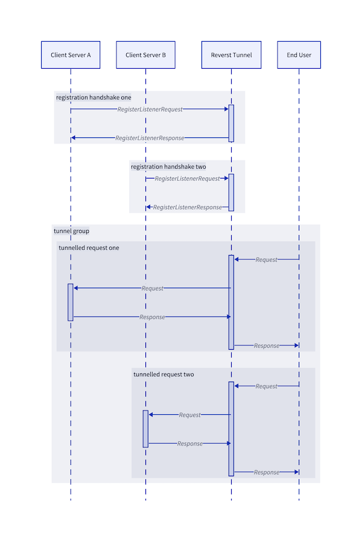

reverst: HTTP reverse tunnels over QUIC
---------------------------------------

> Ti esrever dna ti pilf nwod gnaht ym tup i

Reverst is a (load-balanced) reverse-tunnel server and Go server-client library built on QUIC and HTTP/3.

- Go Powered: Written in Go using [quic-go](https://github.com/quic-go/quic-go)
- Compatible: The Go `client` package is built on `net/http` standard-library abstractions
- Load-balanced: Run multiple instances of your services behind the same tunnel
- Performant: Built on top of QUIC and HTTP/3

## Use-case

Reverst is for exposing services on the public internet from within restrictive networks (e.g. behind NAT gateways).
The tunnel binary is intended to be deployed on the public internet.
Client servers then dial out to the tunnels and register themselves on target tunnel groups.
A tunnel group is a load-balanced set of client-servers, which is exposed through the reverst tunnel HTTP interface.

<p align="center">
  
</p>

## Client

### Install
  
```console
go get go.flipt.io/reverst/client
```

### Building

```console
go install ./client/...
```

## Server

### Building

```console
go install ./cmd/...
```

### Testing

Reverst uses Dagger to setup and run an integration test suite.

```console
dagger call test --source=.
```

The test suite sets up a tunnel, registers a server-client to the tunnel and then requests the service through the tunnels HTTP interface.

### Running

The following walks through experimenting with the [./examples/simple](./examples/simple) server example.
This directory contains a number of things needed to stand up reverst and a registering client server:

- The example service in [./examples/simple/main.go](./examples/simple/main.go).
- Simple self-signed TLS private key and certificate.
- A tunnel-groups file for routing decisions.

#### Running `reverst`

The following runs the tunnel server with:

- The QUIC tunnel listener on `127.0.0.1:7171`
- The HTTP serving listener on `127.0.0.1:8181`
- Logging with `debug` level
- A TLS server-name of `flipt.dev.local`
- Some tunnel group definitions with a single tunnel group
  - The group has the name `flipt.dev.local`
  - The group is reachable under the same host name
  - The group requires basic username and password authentication
- The dummy TLS certificates

```console
go run ./cmd/reverst/... -l debug \
    -n flipt.dev.local \
    -g examples/simple/group.yml \
    -k examples/simple/server.key \
    -c examples/simple/server.crt
```

#### Running example server

Now you can run the example server.
This is a simple HTTP server that responds to all requests with `PONG`.
It is setup to use the server client to register as a listener on the tunnel.

```console
go run ./examples/simple/main.go --username user --password pass
```

#### Making requests

You can now curl the tunnel and requests will be forward all the way through to the example server.
Be sure to include the `Host` header, as this is used to route requests to the respective tunnel-group.

```curl
curl -H 'Host: flipt.dev.local' 127.0.0.1:8181/fo
```

### Usage and Configuration

#### Command-Line Flags and Environment Variables

The following flags can be used to configure a running instance of the `reverst` server.

```console
➜  reverst -h
COMMAND
  reverst

USAGE
  reverst [FLAGS]

FLAGS
  -l, --log LEVEL                    debug, info, warn or error (default: INFO)
  -a, --tunnel-address STRING        address for accepting tunnelling quic connections (default: 127.0.0.1:7171)
  -s, --http-address STRING          address for serving HTTP requests (default: 127.0.0.1:8181)
  -g, --tunnel-groups STRING         path to tunnel groups configuration file (default: groups.yml)
  -n, --server-name STRING           server name used to identify tunnel via TLS (required)
  -k, --private-key-path STRING      path to TLS private key PEM file (required)
  -c, --certificate-path STRING      path to TLS certificate PEM file (required)
      --max-idle-timeout DURATION    maximum time a connection can be idle (default: 1m0s)
      --keep-alive-period DURATION   period between keep-alive events (default: 30s)
```

The long form names of each flag can also be referenced as environment variable names.
To do so, prefix them with `REVERST_`, replace each `-` with `_` and uppercase the letters.

For example, `--tunnel-address` becomes `REVERST_TUNNEL_ADDRESS`.

#### Tunnel Groups Configuration YAML

The reverst server take a path to a YAML encoded file, which identifies the tunnel groups to be hosted.
A tunnel group is a load-balancer on which tunneled servers can register themselves.
The file contains a top-level key groups, under which each tunnel group is uniquely named.

```yaml
groups:
  "group-name":
    hosts:
    - "some.host.address.dev" # Host for routing inbound HTTP requests to tunnel group
    authentication:
      type: "basic"
      username: "user"
      password: "pass"
```

Each group body contains import details for configuring the tunnel groups.

**hosts**

This is an array of strings which is used in routing HTTP requests to the tunnel group when one of the hostnames matches.

**authentication**

This identifies how to authenticate new tunnels attempting to register with the group.
The following types are supported:

- `basic` supports username and password authentication
- `bearer` supports static token based matching
- `external` supports offloading authentication and authorization to an external service
- `insecure` disables authentication for the group (not advised for production)


