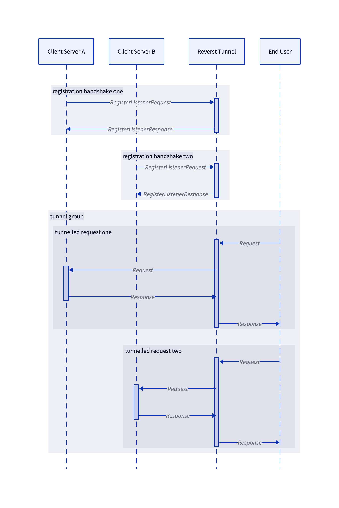

Tunnel Protocol
---------------

This page aims to document the tunnel registration protocol.

  

## Registration

When a tunnel client attempts to establish itself as a listener on a target group managed by a `reverstd` tunnel server, it does the following:

1. Establishes a connection over QUIC.
2. Opens an initial stream intended for registration handshake.
3. Builds a [`RegisterListenerRequest`](https://pkg.go.dev/go.flipt.io/reverst@v0.1.7/pkg/protocol#RegisterListenerRequest).
4. Encodes this onto the stream using msgpack.
5. Reads back a response.
6. Closes the stream.
7. Starts a `http3.Server` over the existing QUIC connection.
